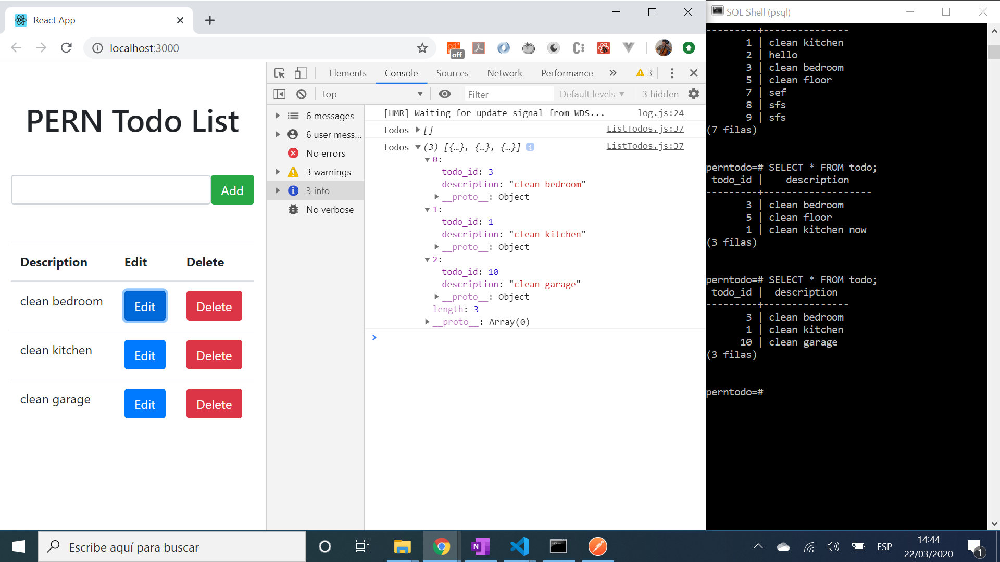

# PERN Full Stack Todo

* PostgreSQL Express React Node (PERN) full-stack app, integrates React frontend with Node.js backend. Tutorial code (see 'Inspiration' below)

*** Note: to open web links in a new window use: _ctrl+click on link_**

## Table of contents

* [General info](#general-info)
* [Screenshots](#screenshots)
* [Technologies](#technologies)
* [Setup](#setup)
* [Features](#features)
* [Status](#status)
* [Inspiration](#inspiration)
* [Contact](#contact)

## General info

### Backend

* PostgreSQL needs to be installed and running - I started it from my Windows 10 PostgreSQL 12 dropdown option 'SQL shell (psql)'
* Postman used to test the backend before frontend was available

### Frontend

* React frontend includes a simple todo list with a user input field and a table of todos below

## Screenshots - Backend


## Screenshots - Frontend




## Technologies - Backend

* [PostgreSQL v12.2](https://www.postgresql.org/)
* [PostgreSQL Installer for Windows](https://www.postgresqltutorial.com/install-postgresql/)
* [Express.js middleware v4.17.1](https://expressjs.com/)
* [Node.js v12.4.0](https://nodejs.org/es/)
* [Nodemon](https://www.npmjs.com/package/nodemon) npm module so backend server will automatically restart afdter code changes
* [Postman API](https://www.postman.com/downloads/) to simulate a frontend

## Technologies - Frontend

* [React framework v16.13.1](https://reactjs.org/)
* [Bootstrap v4.4.1](https://getbootstrap.com/) component library

## Setup - Backend

* Change to `/server` directory
* Install dependencies using `npm i`
* Install [nodemon](https://www.npmjs.com/package/nodemon) globally if you don't already have it
* Install [PostgreSQL](https://www.postgresql.org/) & run it (requires the password you created during installation)
* Run `nodemon server` for a dev server
* `http://localhost:5000/` can be accessed for CRUD operations such as POST, GET, PUT, DELETE etc. using Postman

## Setup - Frontend

* Change to `/client` directory
* Install dependencies using `npm i`. (I have not tried this method and cannot be sure it will work)
* Alternatively - and better - create new React project using `npx create-react-app my-app`
* run `npm start`. Frontend will open at `http://localhost:3000/`

## Code Examples - Backend

* todo

```javascript

```

## Code Examples - Frontend

* todo

```javascript

```

## Features - Backend

* All data stored in PostgreSQL database that can also be viewed and changed from the PostgreSQL shell (psql)

## Features - Frontend

* React app created from the command prompt using [Create React App](https://reactjs.org/docs/create-a-new-react-app.html)
* Uses the [Bootstrap basic table](https://www.w3schools.com/bootstrap/bootstrap_tables.asp) to list todos

## Status & To-Do List

* Status: Working backend. Front-end part complete
* To-Do: Add commenting. Add functionality.

## Inspiration

* [PERN Stack Course - PostgreSQL, Express, React, and Node](https://www.youtube.com/watch?v=ldYcgPKEZC8&t=116s)
* [React documentation](https://reactjs.org/docs/getting-started.html)
* [Enable Emmet support for JSX in Visual Studio Code | React](https://medium.com/@eshwaren/enable-emmet-support-for-jsx-in-visual-studio-code-react-f1f5dfe8809c)

## Contact

Repo created by [ABateman](https://www.andrewbateman.org) - feel free to contact me!
